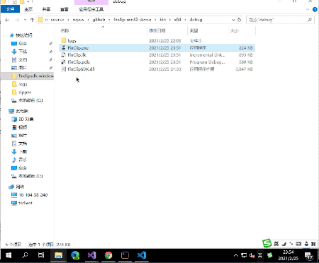

    

 
    <strong>FinClip Desktop DEMO</strong> 

 
        桌面版小程序 DEMO

 
	👉 <a href="https://www.finclip.com?from=github">https://www.finclip.com/</a> 👈

[官方网站](https://www.finclip.com/) | [示例小程序](https://www.finclip.com/#/market) | [开发文档](https://www.finclip.com/mop/document/) | [部署指南](https://www.finclip.com/mop/document/introduce/quickStart/cloud-server-deployment-guide.html) | [SDK 集成指南](https://www.finclip.com/mop/document/introduce/quickStart/intergration-guide.html) | [API 列表](https://www.finclip.com/mop/document/develop/api/overview.html) | [组件列表](https://www.finclip.com/mop/document/develop/component/overview.html) | [隐私承诺](https://www.finclip.com/mop/document/operate/safety.html)

-----
## 🤔 FinClip 是什么?

有没有**想过**，开发好的微信小程序能放在自己的 APP 里直接运行，只需要开发一次小程序，就能在不同的应用中打开它，是不是很不可思议？

有没有**试过**，在自己的 APP 中引入一个 SDK ，应用中不仅可以打开小程序，还能自定义小程序接口，修改小程序样式，是不是觉得更不可思议？

这就是 FinClip ，就是有这么多不可思议！

## 🖥 FinClip SDK 是什么？
开发者可以使用 FinClip SDK 在宿主 APP 中快速实现小程序的能力。一般会用于以下场景：
- 宿主 APP 构建自己的应用生态，既可以面向广泛开发者，也可以定向部分开发者；
- 宿主 APP 通过小程序方式对模块进行解耦，让不同模块的开发团队独立发版，灵活更新；
- 宿主 APP 中部分功能使用 FinClip 小程序实现，降低开发成本，并且提升发布效率；

此外，SDK 还需要配合基础库一并使用，通过基础库提供的小程序生命周期钩子、API函数，页面 DOM创建、渲染以及事件传递等能力为用户提供更加良好的体验。

## 🤩 效果预览

**本项目是 FinClip 小程序在 Win32 环境下的 DEMO 演示，您可以按照下方流程测试，验证 FinClip 小程序在 Windows 环境下的实际效果。**

先看一下运行效果~

    

> 我们已经提供了 DEMO 资源，您可以下载运行，以便获取对应的效果。如果您有相关商业化使用需求，也请与我们联系。

## 桌面版 SDK 支持进展

由于不同应用程序所依赖的语言不同，我们分别为 Win32，Python，JavaScript 提供了不同的 DEMO，您可在下方表格中获取资源或查看研发进展。

|  语言 | GUI 技术  | 状态  | 系统          |  DEMO 地址  |  语言库 |
|---|---|---|---|---|---|
| C++ | win32 | 测试中 | Windows | [win32](examples/win32)  | 无 |
| Python | pyqt 5 | 开发中 | Windows / Mac | [Pyqt](examples/pyqt) |   |
| JavaScript | Electron | 测试中 | Windows | [Electron](examples/electron) | [node](https://github.com/finogeeks/finclip-win32-demo/releases)  |

## DEMO 运行与 SDK 集成说明

### 第一步: 下载对应的 base 包
根据你的系统和架构, 下载对应的 FinClip-SDK；

假如你是 Windows 32 位, 则下载 `finclip-sdk-win-x86-x.y.z.zip` , 并解压至 `vendor/win/x86` 目录下；

### 第二步: 下载语言 SDK

- 对于 Python，JavaScript 编写的应用程序，我们提供了对应语言的库；
- 对于 C/C++ 编写的应用程序则可以直接调用，无须集成额外支持库；

### 第三步: 运行

查看文档，在准备好相应的文件后，即可运行 FinClip DEMO；

## 查看集成文档

在demo文档中, 我们也描述了在该语言环境下, 如何集成FinClip SDK
## 🔗 常用链接
以下内容是您在 FinClip 进行开发与体验时，常见的问题与指引信息

- [FinClip 官网](https://www.finclip.com/#/home)
- [示例小程序](https://www.finclip.com/#/market)
- [文档中心](https://www.finclip.com/mop/document/)
- [SDK 部署指南](https://www.finclip.com/mop/document/introduce/quickStart/intergration-guide.html)
- [小程序代码结构](https://www.finclip.com/mop/document/develop/guide/structure.html)
- [iOS 集成指引](https://www.finclip.com/mop/document/runtime-sdk/ios/ios-integrate.html)
- [Android 集成指引](https://www.finclip.com/mop/document/runtime-sdk/android/android-integrate.html)
- [Flutter 集成指引](https://www.finclip.com/mop/document/runtime-sdk/flutter/flutter-integrate.html)

## ☎️ 联系我们
微信扫描下面二维码，关注官方公众号 **「凡泰极客」**，获取更多精彩内容。 

微信扫描下面二维码，邀请进官方微信交流群（加好友备注：finclip 咨询），获取更多精彩内容。 

