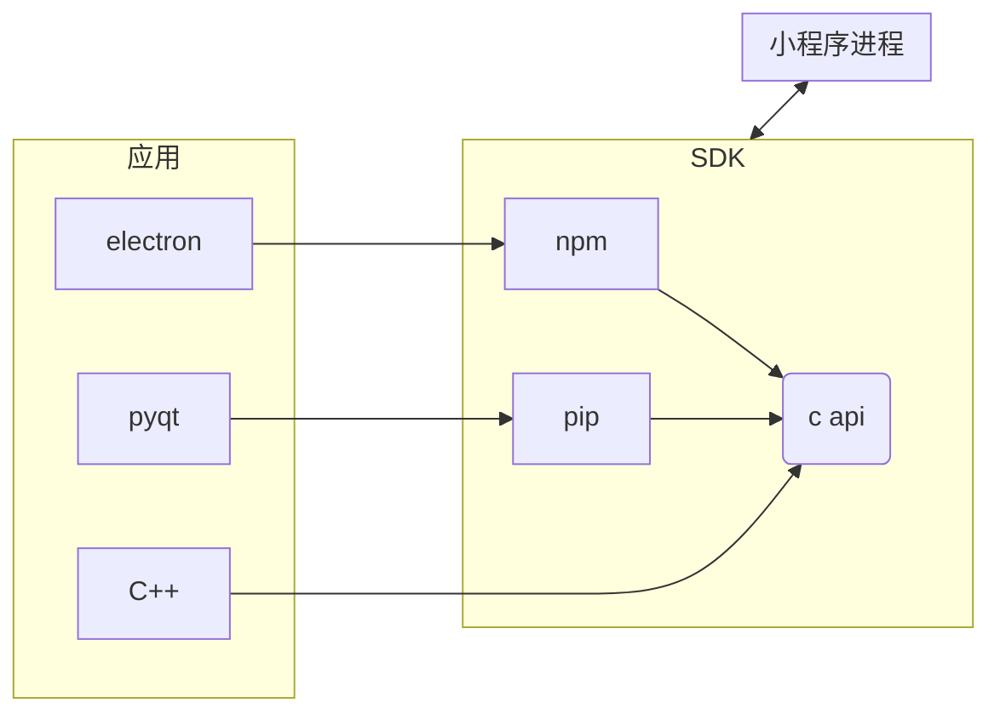

# Finclip SDK的总体架构

如上图所示, Finclip SDK 的核心由 C++ 实现, 对外提供 C api, 对于部分语言, 我们根据实际情况提供了额外的库, 如 pyqt, electron 等.
对于无法直接调用C api的语言, 也可以使用dlopen等手段集成

# 集成步骤

1. 下载release包, 参考demo, 解压至相应的目录
2. 根据实际情况下载语言库和头文件, 参考demo, 解压至相应的目录
3. 根据demo和实际情况, 完成集成

# demo位置

参见首页表格

https://github.com/finogeeks/finclip-desktop-demo