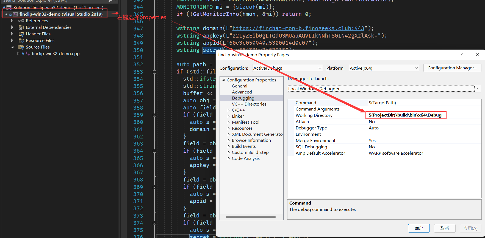

# 📦 安装第三方依赖
Windows 小程序运行环境需要安装以下依赖，请提前配置环境：
- 请下载依赖包[点我下载](https://github.com/finogeeks/finclip-win32-demo/releases)
- 如果您使用的是64位版本, 请解压至vendor/win/x64文件
- 建议使用 Visual Studio 2019或以上版本

# demo运行
## 下载依赖
[下载finclip二进制包](https://github.com/finogeeks/finclip-win32-demo/releases)到`vendor`的对应目录下，如`vendor/win/x64`

## 快速开始

环境准备就绪后, 双击finclip-win32-demo.sln, 在vs中即可运行

# 集成

**注意：依赖包必须随缩主程序一同发布，并在独立目录中存放。**
### 第一步 引入头文件

头文件: https://github.com/finogeeks/finclip-win32-demo/tree/master/src

```c++
#include "finclip_api.h" //引入头文件
#pragma comment(lib, "FinClipSDKWrapper.lib") //引入链接库
```

### 第二步 初始化SDK

```c++

  auto* factory = finclip_get_packer_factory();
  auto* packer = finclip_packer_factory_get_config_packer(factory);
  auto* config = finclip_config_packer_new_config(packer);
  finclip_config_packer_add_config(packer, config);
  finclip_config_set_app_store(config, 1);
  finclip_config_set_app_key(config, "这里输入SDK KEY");
  finclip_config_set_secret(config, "这里输入SDK SECRET");
  finclip_config_set_domain(config, "https://api.finclip.com");
```

- **SDK KEY** 和 **SDK SECRET** 可以从 [FinClip](https://finclip.com/#/home)  获取，点 [这里](https://finclip.com/#/register) 注册账号；
- 进入平台后，在「应用管理」页面添加你自己的包名后，点击「复制」即可获得  key\secret\apisever 字段；
- **apiServer** 和 **apiPrefix** 是固定字段，请直接参考本 DEMO ；
- **小程序 ID** 是管理后台上架的小程序 APP ID，需要在「小程序管理」中创建并在「应用管理」中关联；
> 小程序 ID 与 微信小程序ID 不一样哦！（这里是特指 FinClip 平台的 ID ）


### 第三步 打开小程序
直接从vs启动需要设置 workding dir 为 "$(ProjectDir)\build\bin\x64\Debug", 见下图
<p align="center">
    <a href="#">
    
    </a>
</p>
```c++
  int appstore = 1; // 与第二步一致
  finclip_start_applet(appstore, "这里输入 APP ID");
```